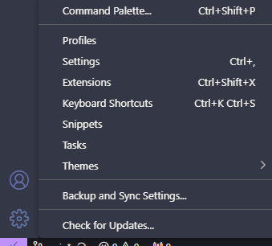
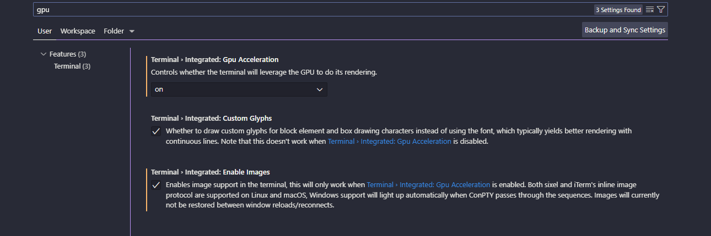

# Dog Breed Identification
<!-- PROJECT LOGO -->
<br />
<p align="center">
  <a href="https://github.com/PhamNamHocCode/Dog-Breed-Identification">
    
  </a>
  <h3 align="center">README</h3>
</p>


<!-- TABLE OF CONTENTS -->
<details open="open">
  <summary>Table of Contents</summary>
  <ol>
    <li>
      <a href="#about-the-project">About The Project</a>
      <ul>
        <li><a href="#built-with">Built With</a></li>
      </ul>
    </li>
    <li>
      <a href="#getting-started">Getting Started</a>
      <ul>
        <li><a href="#dependencies">Dependencies</a></li>
        <li><a href="#installation">Installation</a></li>
      </ul>
    </li>
    <li><a href="#usage">Usage</a></li>
  </ol>
</details>


<!-- ABOUT THE PROJECT -->
## About The Project

This project uses machine learning to identify the breed of a dog given its image.

The data used is from Kaggle's Dog Breed Identification competition.

Dataset: [Kaggle Dog Breed Identification](https://www.kaggle.com/c/dog-breed-identification/data)
This is a multi-class image classification problem, where the goal is to classify images into 120 different dog breeds. Multi-class classification is a powerful technique used in various real-world applications, such as Tesla's self-driving cars or Airbnb's automatic tagging systems.

In this project, we'll use a pretrained model and apply transfer learning to fine-tune it for our specific problem. The process is broken down into several steps, from data preparation to model evaluation and improvement.

### Built With
[TensorFlow](https://www.tensorflow.org/)
[TensorFlow Hub](https://www.tensorflow.org/hub)
<!-- GETTING STARTED -->
## Getting Started

Follow the steps below to set up the project locally.

### Installation

1. Install miniconda
  https://docs.anaconda.com/miniconda/miniconda-install/

2. Clone the repository
  Open miniconda
   ```sh
   git clone https://github.com/PhamNamHocCode/Dog-Breed-Identification.git
   ```
3. Setup (and activate) your environment
  - Turn on GPU in VSCode:
    - Click on Settings
      
    - You should turn on all of these:
      
  - Setup environment:
  ```sh
  cd Dog-Breed-Identification
  ```
  ```sh
  conda create --name dog_breed_env python=3.9.19
  ```
  ```sh
  conda activate dog_breed_env
  ```
  ```sh
  conda install -n dog_breed_env ipykernel --update-deps --force-reinstall
  ```
  ```sh
  pip install tensorflow
  ```
  ```sh
  pip install tensorflow-hub
  ```
  ```sh
  pip install pandas
  ```
  ```sh
  pip install matplotlib
  ```
  ```sh
  pip install scikit-learn
  ```

### Dependencies

List of required libraries and versions:
* TensorFlow 2.17.0
* TensorFlow Hub 0.13.0
### Alternative: Export your Environment

  ```sh
  
  ```


<!-- USAGE EXAMPLES -->
## Usage

## Thank you

